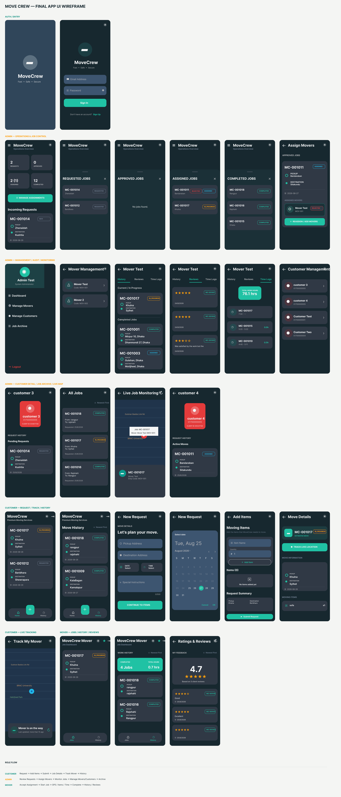

# MoveCrew 🚚

**MoveCrew** is a role-based moving service management application built with **Flutter** and **Supabase**. It connects Customers, Admins, and Movers through a coordinated workflow for creating move requests, assigning movers, tracking active jobs, managing moving items, recording work hours, monitoring live GPS locations, and reviewing completed services.

The application uses **Supabase Authentication, PostgreSQL, Row Level Security (RLS), RPC functions, Realtime**, and **Google Maps**.

---

## 🗄️ Database Schema

The MoveCrew database connects users, movers, jobs, assignments, job items, time logs, GPS locations, and customer reviews through a relational PostgreSQL structure.

<p align="center">
  
</p>

Main database entities:

- **Users** — Registered users and their roles.
- **Movers** — Mover information and employee codes.
- **Jobs** — Customer move requests and job status.
- **Assignments** — Connects movers with jobs.
- **Job Items** — Items and quantities associated with each move.
- **Time Logs** — Mover clock-in and clock-out records.
- **Mover Locations** — GPS coordinates captured during active jobs.
- **Reviews** — Customer ratings and feedback.

---

## 🚀 Key Features

### 🔐 Authentication & Roles
- Secure login using **Supabase Auth**.
- Three user roles: **Customer, Admin, and Mover**.
- Separate dashboards and navigation flows for each role.

### 📦 Customer Move Requests
- Create moving requests with pickup and destination addresses.
- Select move date and start time.
- Add special instructions.
- Add multiple moving items and quantities.
- Automatically generate unique MoveCrew job codes.

### 👨‍💼 Admin Job Management
- Review incoming customer requests.
- Approve or reject requested jobs.
- Assign and reassign movers.
- Monitor requested, approved, assigned, in-progress, and completed jobs.
- Manage registered customers and movers.
- Access the complete job archive.

### 👷 Mover Task Management
- View assigned jobs.
- Accept or reject assignments.
- Start accepted jobs.
- Update moving-item progress.
- Clock in and clock out.
- Complete active jobs.
- View work history, ratings, and reviews.

### 📍 Real-Time GPS Tracking
- Capture mover GPS locations during active jobs.
- Store GPS coordinates in Supabase.
- Stream location updates using **Supabase Realtime**.
- Customers can track their assigned mover.
- Admins can monitor active movers through the Live Job Monitoring screen.

### ⏱️ Work Time Tracking
- Job-specific Clock-In / Clock-Out system.
- Records mover work sessions and timestamps.
- Prevents duplicate active work sessions.
- Displays mover work history and total hours.

### ⭐ Ratings & Reviews
- Customers can rate movers after completed jobs.
- Customers can leave written feedback.
- Movers and Admins can view rating and review history.

### 🔄 Controlled Job Workflow

MoveCrew follows a structured job lifecycle:

```text
REQUESTED
   ↓
APPROVED
   ↓
ASSIGNED
   ↓
IN_PROGRESS
   ↓
COMPLETED
```

Important job and assignment transitions are validated through the backend to maintain data consistency and prevent unauthorized actions.

---

## 👥 Role-Based Workflow

### Customer

```text
Login / Sign Up
      ↓
Create Move Request
      ↓
Add Moving Items
      ↓
Submit Request
      ↓
Track Job Status
      ↓
Track Assigned Mover
      ↓
Job Completed
      ↓
View History / Submit Review
```

### Admin

```text
Login
  ↓
Operations Dashboard
  ↓
Review Incoming Requests
  ↓
Approve / Reject
  ↓
Assign Movers
  ↓
Monitor Active Jobs
  ↓
Manage Movers / Customers
  ↓
Job Archive
```

### Mover

```text
Login
  ↓
View Assignment
  ↓
Accept / Reject
  ↓
Start Job
  ↓
Clock In + GPS Tracking
  ↓
Update Moving Items
  ↓
Clock Out
  ↓
Complete Job
  ↓
View History / Reviews
```

---

## 🛠️ Tech Stack

- **Frontend:** Flutter / Dart
- **Backend:** Supabase
- **Database:** PostgreSQL
- **Authentication:** Supabase Auth
- **Security:** Row Level Security (RLS)
- **Realtime:** Supabase Realtime
- **State Management:** Riverpod
- **Navigation:** go_router
- **Mapping:** Google Maps Flutter
- **Location Services:** Geolocator
- **Local Preferences:** SharedPreferences
- **Platform:** Android

---

## 📁 Project Structure

The project follows a feature-oriented Flutter structure that separates UI, data access, shared tools, and application logic.

```text
move_crew/
│
├── Docs/
│   ├── Final_Schema_Diagram.png
│   ├── Final_Wireframe_Diagram.png
│   ├── Initial_Schema_Diagram.png
│   └── Initial_Wireframe_Diagram.png
│
├── android/
│
├── database/
│   └── Supabase schema, RLS policies, RPCs and setup SQL
│
├── lib/
│   ├── core/
│   │   ├── config/
│   │   ├── constants/
│   │   ├── router/
│   │   ├── theme/
│   │   ├── utils/
│   │   └── widgets/
│   │
│   ├── data/
│   │   ├── models/
│   │   ├── repositories/
│   │   └── supabase_client.dart
│   │
│   ├── features/
│   │   ├── admin/
│   │   ├── auth/
│   │   ├── customer/
│   │   └── mover/
│   │
│   ├── providers/
│   ├── app.dart
│   └── main.dart
│
├── test/
├── pubspec.yaml
├── run_movecrew.ps1
└── README.md
```

### Important Directories

- **`lib/core/`** — Themes, routing, constants, utilities, configuration, and reusable widgets.
- **`lib/data/`** — Models and repositories used to communicate with Supabase.
- **`lib/features/admin/`** — Admin dashboard, assignment management, mover/customer management, job archive, and live monitoring.
- **`lib/features/customer/`** — Move requests, moving items, move history, job details, and live mover tracking.
- **`lib/features/mover/`** — Job assignments, active-job workflow, GPS tracking, item updates, and work history.
- **`lib/providers/`** — Riverpod providers for application state and realtime data.
- **`database/`** — SQL files for the MoveCrew Supabase backend.
- **`Docs/`** — Schema diagrams, wireframes, and project documentation.

---

## ⚙️ Getting Started

### Prerequisites

Before running the project, make sure you have:

- Flutter SDK
- Dart SDK
- Android Studio
- Android SDK
- Android device or emulator
- Supabase project
- Google Maps API Key

Check the Flutter environment:

```bash
flutter doctor
```

### Clone the Repository

```bash
git clone https://github.com/fahimfuad71-stack/Move-Crew.git
```

Navigate to the project:

```bash
cd Move-Crew
```

Install dependencies:

```bash
flutter pub get
```

### Database Setup

The Supabase database setup files are available inside:

```text
database/
```

They contain the required database schema, relationships, RLS policies, functions, RPCs, and supporting configuration.

### Run the Application

MoveCrew requires valid Supabase configuration and a Google Maps API key.

The project can be started using:

```powershell
.\run_movecrew.ps1
```

---

## 🎨 Final UI Wireframe

The final wireframe below represents the implemented MoveCrew interface across the **Admin, Customer, and Mover** roles.

<p align="center">
  
</p>

The wireframe covers the main application interfaces including authentication, Admin operations, customer request creation, mover assignment, live GPS tracking, work history, customer and mover management, job monitoring, and ratings and reviews.

---

## 🚚 MoveCrew

**Fast • Safe • Secure**
